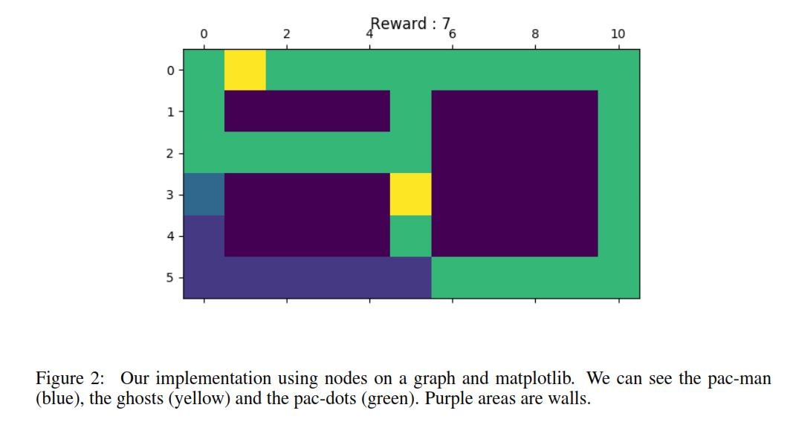

# Reinforcement learning applied to PAC-MAN

This project uses python3

## Install requirements
```shell
pip3 install -r requirements.txt
```

## Try it !

We implemented a simplified pacman game, with pac-dots and ghosts.



### Manual mode

```shell
python3 demo_manual_play.py
```

## Watch pac-man learn

Mastering easy boards ...

```shell
python3 demo_mcts_3x3.py
```

... and struggling with more complicated ones

```shell
python3 demo_mcts_4x4.py
```

```shell
python demo_mcts_simple.py
```

## Read more about it

Take a look at our [report](report/pac-man-report-louis-martin-yana-hasson.pdf)
